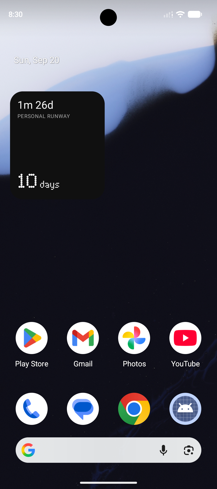

# Runway

A private personal-finance dashboard and 2×2 Android widget powered by [Fold Money MCP](https://mcp.fold.money/mcp).



The widget shows:

- **Total runway** — bank balance + investments − debt, divided by recent monthly burn.
- **Liquid runway** — bank balance only, expressed in days.

## How it works

```text
Fold OAuth → Cloudflare Worker → KV snapshot → Web app / Android widget
                         ↑                         │
                   every 6 hours           checks every 15 min
```

Only aggregate balances, runway values, and three monthly burn totals are stored. Failed refreshes leave the last successful snapshot intact.

## Prerequisites

- Node.js 20+
- A Cloudflare account
- A Fold account
- Android Studio with JDK 17 and Android SDK 35

## 1. Clone and install

```bash
git clone https://github.com/hellosatyajit/runway.git
cd runway
npm install
```

## 2. Deploy the Cloudflare Worker

```bash
npx wrangler login
npx wrangler kv namespace create RUNWAY_CACHE
npx wrangler kv namespace create RUNWAY_CACHE --preview
cp worker/wrangler.example.toml worker/wrangler.toml
```

Replace both placeholder KV IDs in `worker/wrangler.toml` with the returned values.

Generate a private API token and keep it in your password manager:

```bash
export RUNWAY_API_TOKEN="$(openssl rand -hex 32)"
printf '%s' "$RUNWAY_API_TOKEN" | npx wrangler secret put RUNWAY_API_TOKEN --config worker/wrangler.toml
printf '%s' 'https://mcp.fold.money/mcp' | npx wrangler secret put FOLD_MCP_URL --config worker/wrangler.toml
```

Save `RUNWAY_API_TOKEN` in your password manager, then deploy:

```bash
npm run worker:deploy
```

Wrangler prints a URL like `https://personal-runway-api.<your-subdomain>.workers.dev`.

## 3. Connect Fold

```bash
curl -X POST \
  -H "Authorization: Bearer $RUNWAY_API_TOKEN" \
  https://personal-runway-api.<your-subdomain>.workers.dev/oauth/start
```

Open the returned `authorizationUrl`, sign into Fold, and approve access. The callback stores renewable OAuth credentials in KV and creates the first snapshot.

```bash
curl -H "Authorization: Bearer $RUNWAY_API_TOKEN" \
  https://personal-runway-api.<your-subdomain>.workers.dev/oauth/status
```

## 4. Run the web dashboard

Copy `.env.example` to `.env.local` and set:

```dotenv
VITE_RUNWAY_API_URL=https://personal-runway-api.<your-subdomain>.workers.dev
VITE_RUNWAY_API_TOKEN=<your RUNWAY_API_TOKEN>
```

```bash
npm run dev
```

The browser token is visible to the browser user. Keep the deployment private or protect it with Cloudflare Access.

## 5. Build the Android widget

Create the gitignored `android/local.properties`:

```properties
sdk.dir=/path/to/Android/sdk
RUNWAY_API_URL=https\://personal-runway-api.<your-subdomain>.workers.dev
RUNWAY_API_TOKEN=<your RUNWAY_API_TOKEN>
```

```bash
cd android
./gradlew assembleDebug
```

Install `android/app/build/outputs/apk/debug/app-debug.apk`, then add **Runway** from the Android widget picker. It requests a fixed 2×2 footprint.

## Refresh behaviour

- Cloudflare refreshes Fold every six hours.
- Android reads the cached snapshot every 15 minutes when online.
- The companion app can request an immediate Fold sync.
- OAuth access tokens refresh automatically.
- Offline and failed refreshes retain the last successful values.

## Security and licensing

`.env.local`, `worker/wrangler.toml`, `worker/.dev.vars`, and `android/local.properties` are ignored.

The single-user APK contains `RUNWAY_API_TOKEN`; do not distribute it publicly. A multi-user release needs per-user authentication and short-lived credentials.

The bundled Ndot57 font comes from [xeji01/nothingfont](https://github.com/xeji01/nothingfont). That repository provides no explicit redistribution license and credits Nothing with “All Rights Reserved.” Confirm licensing or replace it before public distribution.
